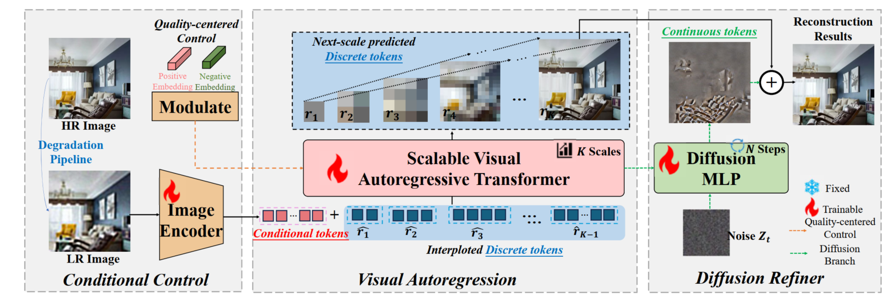
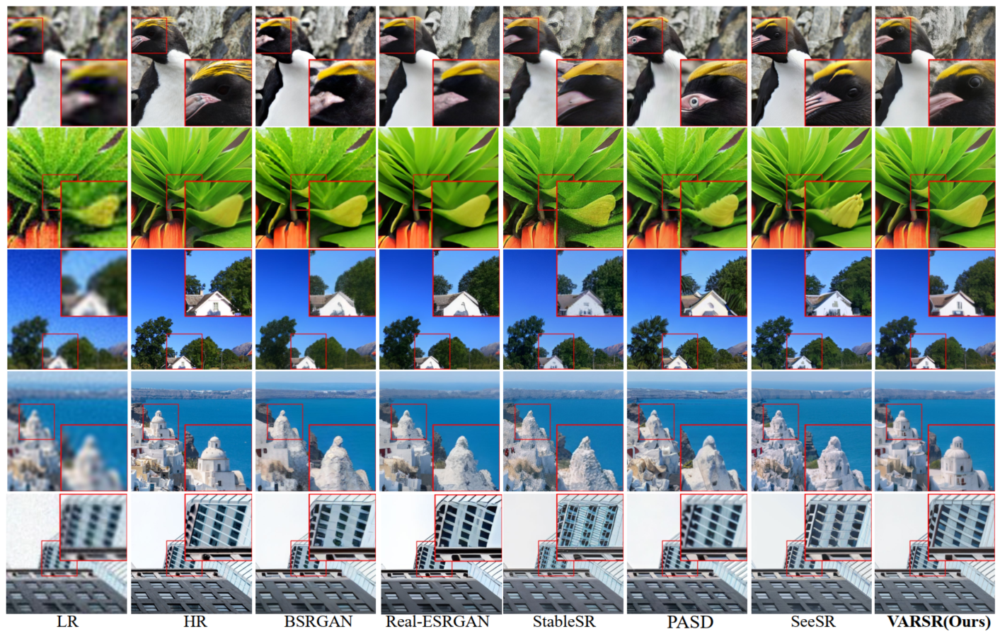

# VARSR: Visual Autogressive Modeling for Image Super Resolution
<div align="center">

[](https://arxiv.org/abs/2501.18993)&nbsp;
[](https://huggingface.co/qyp2000/VARSR)&nbsp;


Yunpeng Qu<sup>1,2</sup> | Kun Yuan<sup>2</sup> | Jinhua Hao<sup>2</sup> | Kai Zhao<sup>2</sup> | Qizhi Xie<sup>1,2</sup> | Ming Sun<sup>2</sup> | Chao Zhou<sup>2</sup>

<sup>1</sup>Tsinghua University, <sup>2</sup>Kuaishou Technology.
</div>


## 🚀 Overview framework

Image Super-Resolution (ISR) has seen significant progress with the introduction of remarkable generative models. However, challenges such as the trade-off issues between fidelity and realism, as well as computational complexity, have also posed limitations on their application. Building upon the tremendous success of autoregressive models in the language domain, we propose \textbf{VARSR}, a novel visual autoregressive modeling for ISR framework with the form of next-scale prediction. To effectively integrate and preserve semantic information in low-resolution images, we propose using prefix tokens to incorporate the condition. Scale-aligned Rotary Positional Encodings are introduced to capture spatial structures and the diffusion refiner is utilized for modeling quantization residual loss to achieve pixel-level fidelity. Image-based Classifier-free Guidance is proposed to guide the generation of more realistic images. Furthermore, we collect large-scale data and design a training process to obtain robust generative priors. Quantitative and qualitative results show that VARSR is capable of generating high-fidelity and high-realism images with more efficiency than diffusion-based methods.


## 🚀 Results



## 🔥Installation
```
## git clone this repository
git clone https://github.com/qyp2000/VARSR.git
cd VARSR

# create an environment with python >= 3.9
conda create -n varsr python=3.9
conda activate varsr
pip install -r requirements.txt
```


## 🔥Inference
#### Step 1: Download the pretrained models and test data
- Download VARSR and VQVAE model from <a href='https://huggingface.co/qyp2000/VARSR'></a> and put it into ``checkpoints/``.
- Prepare testing LR images in the `testset`, e.g., `testset/{folder_path}/LR`.

#### Step 2: Run code
- To generate standard 512*512 images:
```
python test_varsr.py
```
You can modify the parameters to adapt to your specific need, such as the `cfg` which is set to 6.0 by default.

- To generate high-resolution images:
```
python test_tile.py
```
You can modify the parameters to adapt to your specific need, such as the `cfg` which is set to 7.0 by default and the `super-resolution scale` which is set to 4.0 by default.


## 🔥 Train 

#### Step1: Download the pretrained models and training data
- Download VQVAE model from <a href='https://huggingface.co/qyp2000/VARSR'></a> and put it into ``checkpoints/``.
- Download pretrained original VAR models from [VAR](https://github.com/FoundationVision/VAR) and put them into ``checkpoints/``. You can also use the C2I VARSR pretrained on our large-scale dataset, which can be downloaded from <a href='https://huggingface.co/qyp2000/VARSR'></a>.
- Prepare your own training images into `trainset`, e.g., `trainset/{folder_path}`. And you can put your negative samples into `trainset_neg`, e.g., `trainset_neg/{folder_path}`. More changes to the dataset path can be done in the file `dataloader/localdataset_lpm.py`.

#### Step2: Run code
```
torchrun --nproc-per-node=8 train.py --depth=24 --batch_size=4 --ep=5 --fp16=1 --tblr=5e-5 --alng=1e-4 --wpe=0.01 --wandb_flag=True --fuse=0 --exp_name='VARSR'
```
You can modify the parameters in `utils/arg_util.py` to adapt to your specific need, such as the `batch_size` and the `learning_rate`.


## 🔥Class-to-Image Inference
We also provide pretrained Class-to-Image model weights and inference code to contribute more to the academic community.

#### Step 1: Download the pretrained models
- Download the C2I VARSR pretrained on our large-scale dataset, which can be downloaded from <a href='https://huggingface.co/qyp2000/VARSR'></a>.

#### Step 2: Run code
```
python test_C2I.py
```
Our dataset contains 3830 semantic categories, and you can adjust the `classes` to generate images corresponding to each category.

## Citations
If our work is useful for your research, please consider citing and give us a star ⭐:
```
@article{qu2025visual,
  title={Visual Autoregressive Modeling for Image Super-Resolution},
  author={Qu, Yunpeng and Yuan, Kun and Hao, Jinhua and Zhao, Kai and Xie, Qizhi and Sun, Ming and Zhou, Chao},
  journal={arXiv preprint arXiv:2501.18993},
  year={2025}
}
```

## Contact
Please feel free to contact: `qyp21@mails.tsinghua.edu.cn`. 
I am very pleased to communicate with you and will maintain this repository during my free time.

## Acknowledgments
Some codes are brought from [VAR](https://github.com/FoundationVision/VAR), [MAR](https://github.com/LTH14/mar) and [HART](https://github.com/mit-han-lab/hart). Thanks for their excellent works.

## 🔥 FastVAR 推理加速使用说明 (Token Pruning)

我们在 `test_varsr_fastvar.py` 中加入 FastVAR 训练后免调参的 token 剪枝, 通过在后期尺度丢弃低重要性 tokens 减少计算。

### 参数列表
| 参数 | 说明 | 默认 |
|------|------|------|
| `--fastvar` | 启用 FastVAR 剪枝 | False |
| `--fastvar_second_last_ratio` | 倒数第二尺度丢弃比例 (drop ratio) | 0.4 |
| `--fastvar_last_ratio` | 最后尺度丢弃比例 | 0.3 |
| `--fastvar_later_layer_start` | 每尺度从该层 index (0-based) 开始剪 | 3 |
| `--fastvar_min_keep` | 每层最少保留 tokens | 64 |
| `--fastvar_quiet` | 静默: 不打印逐层 Debug | False |
| `--export_intermediate` | 导出中间尺度重建图 | False |
| `--intermediate_max` | 导出中间尺度最大数量 | 10 |

注意：`*_ratio` 为丢弃比例 (drop)，实际保留≈ `1 - ratio` 但受 `--fastvar_min_keep` 约束。

### 输出
启用 `--export_intermediate` 后，最终图所在目录新增 `<basename>_scales/side<patch>.png`，含多个尺度及最终尺度一份。

### 常用示例
适中剪枝：
```bash
python test_varsr_fastvar.py --fastvar --fastvar_second_last_ratio 0.4 --fastvar_last_ratio 0.3
```
仅剪倒数第二尺度：
```bash
python test_varsr_fastvar.py --fastvar --fastvar_second_last_ratio 0.5 --fastvar_last_ratio 0
```
激进实验：
```bash
python test_varsr_fastvar.py --fastvar --fastvar_second_last_ratio 0.99 --fastvar_last_ratio 0 --fastvar_min_keep 64
```
导出前 5 个中间尺度并静默：
```bash
python test_varsr_fastvar.py --fastvar --fastvar_second_last_ratio 0.4 --fastvar_last_ratio 0.3 \
  --fastvar_quiet --export_intermediate --intermediate_max 5
```

### 调参建议
- 先用 0.3~0.5 观察质量/速度，再逐步提高。
- 质量差：降低 drop ratio 或增大 `--fastvar_min_keep` (如 128)。
- 需要更稳：增大 `--fastvar_later_layer_start` 使前几层不剪。

### 对比基准
```bash
# baseline (无剪枝)
python test_varsr_fastvar.py
# FastVAR
python test_varsr_fastvar.py --fastvar --fastvar_second_last_ratio 0.4 --fastvar_last_ratio 0.3 --fastvar_quiet
```
比较总耗时与质量指标即可评估加速性价比。

---
集成提示（其它脚本）：参考 `test_varsr_fastvar.py`：构造 VAR_RoPE 时加 `enable_fastvar_prune=True` 与 `fastvar_override_map`；运行时用 `autoregressive_infer_cfg(..., return_intermediate=True)` 获取中间尺度。
